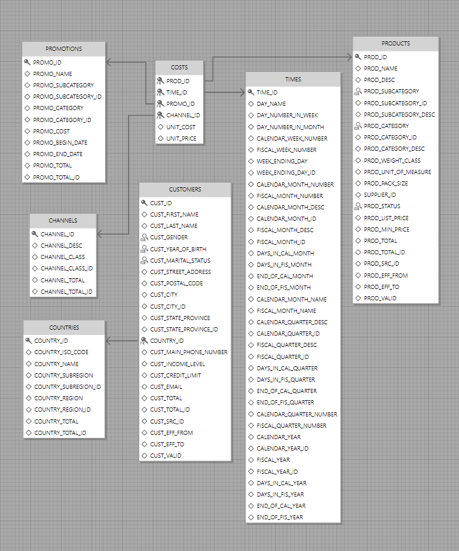

# Database - Server - Client ORM example

This ORM does not claim to be of industrial quality. It is rather a concept for those who do something similar in their project. I tried to make the code minimalistic and understandable to convey the main solutions of this concept.

Historical background: the need for such a solution arose when I was working with Oracle DBMS in the cloud via VPN and local desktop client, when there was a large ping to the DB. In such a configuration, the data fetch speed of this DB drops by orders of magnitude.

The only solution I found was to change the data transfer protocol to protobuf and for this I had to add a server to the system. Mainstream ORMs do not work in such a configuration.

The system is designed to request data from the DB through the server application, using a LINQ on the client.

I used the [OrmFactory database manager](https://ormfactory.com) to work with the model and run the code generator. The ER-diagram was also exported by this application.

The test scheme is taken from the [Oracle sample schemas repository](https://github.com/oracle-samples/db-sample-schemas). Look for `sales_history`.



A three-tier architecture was taken as a basis. The exchange protocol between the client and the server is gRPC. Both use .NET 8.

## Repository structure

- `Client` - client solution folder
- `Images` - images folder for this readme
- `Schema` - place for OrmFactory's model and python code generator
- `Server` - server solution folder
- `Shared` - folder for shared between client and server project

## Principle

Clien-side request:

```csharp
var list = Tables.Costs
	.Where(c => c.ProdId == 0 && c.UnitCost > 10.0m)
	.OrderBy(c => c.ChannelId)
	.Take(10)
	.ToList();
```

Turned into XML message:

```xml
<RequestExpression xmlns:xsi="http://www.w3.org/2001/XMLSchema-instance" xmlns:xsd="http://www.w3.org/2001/XMLSchema" OrderByField="ChannelId">
	<Limit Take="10" />
	<Condition Operator="And">
		<Left Operator="Equal">
			<Left Operator="Parameter" Value="ProdId" />
			<Right Operator="Value" Value="0" />
		</Left>
		<Right Operator="GreaterThan">
			<Left Operator="Parameter" Value="UnitCost" />
			<Right Operator="Value" Value="10,0" />
		</Right>
	</Condition>
</RequestExpression>
```

The server turns this into a query for the database and returns the result via gRPC stream. The client turns this stream into an enumerated stream and gives the mapped entities to the logic.

## Testing

I installed Oracle on a virtual machine. To check, I will select all records from products:


Next, I connected the computer and the virtual machine to the remote VPN server. Now the ping is about 230 ms. Let's check fetch:


